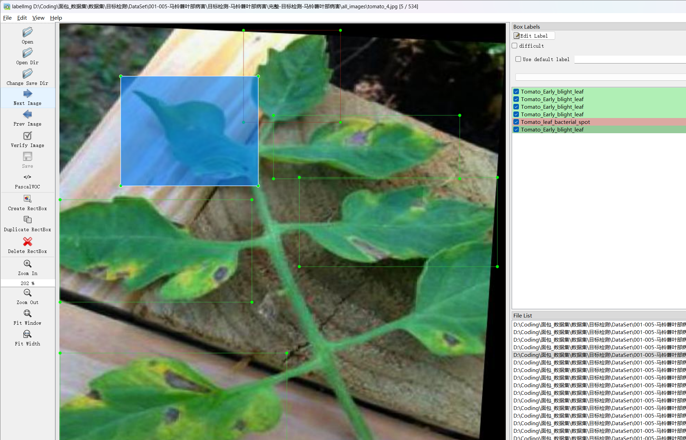

# Tomato Leaf Disease Detection Dataset

Dataset Information: This dataset consists of 534 images and corresponding annotation files. The annotation files are provided in two formats: VOC (XML) and YOLO (TXT). The objects annotated include the following:
- ['Tomato_leaf_late_blight', 'Tomato_leaf_bacterial_spot', 'Tomato_leaf_yellow_virus', 'Tomato_Early_blight_leaf', 'Tomato_leaf', 'Tomato_Septoria_leaf_spot', 'Tomato_leaf_mosaic_virus', 'Tomato_mold_leaf']

The number of bounding boxes for each object is as follows:
- Tomato_leaf_late_blight: 199
- Tomato_leaf_bacterial_spot: 266
- Tomato_leaf_yellow_virus: 221
- Tomato_Early_blight_leaf: 126
- Tomato_leaf: 647
- Tomato_Septoria_leaf_spot: 285
- Tomato_leaf_mosaic_virus: 165
- Tomato_mold_leaf: 235

Note: An image may be annotated with multiple objects, so the total number of bounding boxes may exceed the number of images.

The complete dataset includes three folders and one txt file:
- all_images: Stores the dataset images. Screenshots are not included due to limitations.
- all_txt: Contains YOLO formatted txt annotation files, in the same quantity as images, with each annotation file corresponding to an image.
- classes.txt: For a detailed understanding of the standard YOLO format, please search online. In brief, the first number in the array corresponds to the name in the classes.txt file.
- all_xml: VOC formatted XML annotation files. They correspond to the annotation files in the same manner as the all_txt folder.

Both annotation formats are usable; choose one based on your preference.
Annotation screenshots are not included as they would require additional screenshots which are not provided here.

## Images

Here is a pay link on Stripe ( https://buy.stripe.com/3cs8yP7sY87d0vu9AB ). Please contact me lonlonago@foxmail.com after funding $89, and I will send you a complete data files , thank you!

